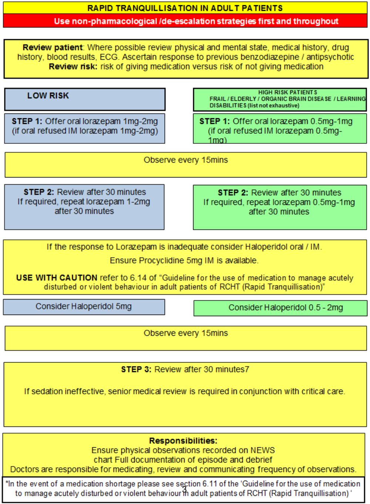

# Rapid Tranquilisation
## Summary Flowchart

## Notes

Indication:
- Age > 16
- If less restrictive strategies have failed
- If there is a imminent risk of dangerous behaviour which risks the patient or others, or if the patient is exhausted

**High Risk** *: frail, elderly, organic brain disease, learning disability

Lorazepam
- 1 - 2 mg Lorazepam PO/IM (0.5 - 1 mg *)
- Repeat at 30 minutes if required
- Alternative: Diazepam - 5 - 10 mg (2.5 - 5 mg *)

Haloperidol
- 5 mg PO/IM (0.5 - 2 mg *) maximum 10 mg / 24 hours
- Contraindications: NMS, dystonia, severe EPSEs, significant cardiac disease, prolonged QTc, acute alcohol withdrawal, Parkinson's, Lewy Body Dementia; caution in epilepsy
- Acute dystonia, oculogyric crisis, laryngospasm: 5 - 10 mg Procyclidine IM, repeat at 20 minutes if required

**Olanzapine**
- 5 - 10 mg PO/IM
- Avoid in high risk patients*, and not within 30 minutes of a benzodiazepine
