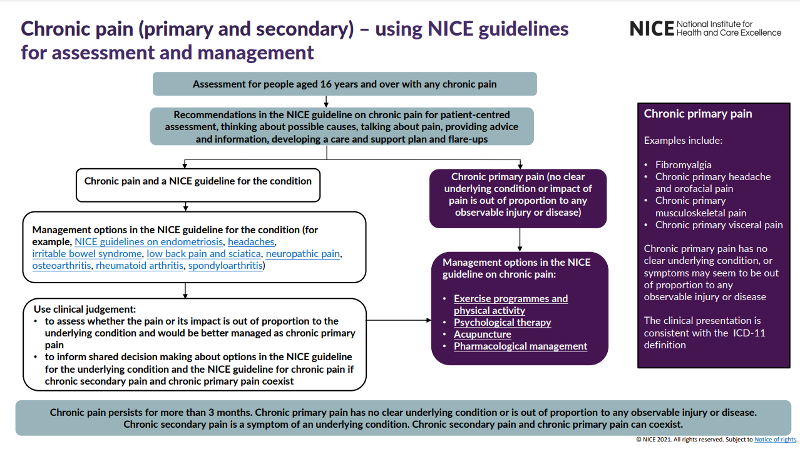

# Chronic Pain

{+Pain lasting longer than three months is chronic+}

{+For primary chronic pain, offer exercise, ACT, CBT, and antidepressants; consider weaning and stopping all other drugs unless benefits outweigh risks+}

[Chronic Pain NICE Guidelines](attachments/NICE-chronic-pain-2021.pdf)

# Definitions

Chronic: longer than three months

Primary: no underlying cause, though several syndromes exist (ie fibromyalgia, complex regional pain syndrome, chronic primary headache)

Secondary: underlying condition (ie osteoarthritis, rheumatoid arthritis, endometriosis, ulcerative colitis)

# Assessment

Biological, Psychological, Emotional, Social, Expectations and Beliefs

How is the patient, and their family, carers, and significant others, affected by their pain? Daily activities, physical and psychological wellbeing, stressful life events, substance misuse, social interaction, employment, housing, and other social concerns.

What are the patient's strengths? Views on living well, skills and techniques for managing their pain.

What is their understanding and belief regarding their pain? Causes, prognosis, and outcomes of possible treatments.

# Patient Information

> the likelihood that symptoms will fluctuate over time and that they may have flare-ups
>
> the possibility that a reason for the pain (or flare-up) may not be identified
>
> the possibility that the pain may not improve or may get worse and may need ongoing management
>
> there can be improvements in quality of life even if the pain remains unchanged [^NG193]

# Management of Chronic **Primary** Pain

Specific NICE guidelines exist for certain causes of secondary chronic pain: headaches, low back pain and sciatica, rheumatoid arthritis, osteoarthritis, spondyloarthritis, endometriosis, neuropathic pain and irritable bowel syndrome

## Non-Pharmacological

- Supervised group exercise programmes
- Encourage physical activity
- Consider acceptance and commitment therapy (ACT) or cognitive behavioural therapy (CBT)
- Consider a single course of acupuncture
- Do Not Offer: TENS, ultrasound, interferential therapy

## Pharmacological

- Antidepressant: amitriptyline, citalopram, duloxetine, fluoxetine, paroxetine or sertraline
    - May improve quality of life, pain, sleep, and psychological distress
- Do Not Initiate: antiepileptics, gabapentinoids, antipsychotics, benzodiazepines, corticosteroid trigger point injections, ketamine, local anaesthetics, NSAIDs, opioids[^opioid], or paracetamol
- If a patient is already taking these medications: discuss the lack of evidence of benefit, continue if they report benefit at a safe dose and few harms, or support reduction and cessation if there is little benefit and significant harm [^NG215]
- If stopping these medications, anticipate and manage withdrawal symptoms [^NG215]

# References

[^NG193]: [Chronic pain (primary and secondary) in over 16s: assessment of all chronic pain and management of chronic primary pain NICE guideline \[NG193\]Published: 07 April 2021](https://www.nice.org.uk/guidance/ng193)

[^NG215]: [Medicines associated with dependence or withdrawal symptoms: safe prescribing and withdrawal management for adults
NICE guideline [NG215]Published: 20 April 2022](https://www.nice.org.uk/guidance/ng215/chapter/Recommendations)

[^opioid]: _"No evidence was identified on the effectiveness of opioids for chronic primary pain. Although there were limitations, evidence from non-randomised studies on the long-term use (more than 6 months) of opioids for chronic pain suggested an increased risk of dependence. Based on their experience, the committee agreed that even short-term use of opioids could be harmful for a chronic condition. The evidence of long‑term harm, along with lack of evidence on effectiveness of opioids, persuaded the committee to recommend against starting opioid treatment for people with chronic primary pain."_

[[J] Evidence review for pharmacological
management for chronic primary pain
](https://www.nice.org.uk/guidance/ng193/evidence/j-pharmacological-management-for-chronic-primary-pain-pdf-326591532181)

- [ ] Add RCOA's chronic pain guidelines
https://fpm.ac.uk/opioids-aware
