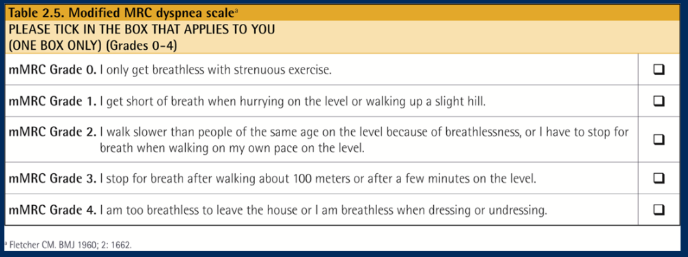

# COPD
## Diagnosis
Consider COPD in smokers aged over 40 years with recurrent antibiotics for chest infections. Other risk factors include occupational exposure and alpha-1 antitrypsin deficiency

Presenting with symptoms of progressive dyspnoea, chronic productive cough, and wheeze

Diagnose with post-bronchodilator spirometry: FEV1/FVC < 70% with progressive respiratory symptoms is diagnostic of COPD, though may under-diagnose in women and younger patients

Assess for co-morbid asthma? diurnal variation, atopy, bronchodilator reversibility > 12% implies element of asthma

WHO Suggests Alpha-1 Antitrypsin levels in all new diagnoses

## Grading
GOLD Modified ABCD assessment Tool - patients get a numerical grade and letter category. The number quantifies degree of airflow limitation, the letter assesses exacerbation frequency and functional limitation.

Modified MRC Dyspnoea Scale

COPD Assessment Test (CAT) - measures impact of symptoms on QOL

## Management

### Smoking Cessation
Smoking cessation slows rate of decline in FEV1

Start prescription two weeks before chosen stop date
- Nicotine Replacement Therapy: 8-12 weeks, then slow taper over up to 9 months
- Bupropion: 7-9 weeks, not in pregnancy, c.i. in seizure disorder
- Varenicline: 12+12 weeks, not in pregnancy, previous suspected links with suicidality/depression, current evidence suggests no reason to withhold from patients with mental health issues

### Pulmonary Rehabilitation
- Programme of physical exercise and information
- Improves dyspnoea, health status, and exercise tolerance
- Should be started within four weeks of an acute hospital admission

## NICE Algorithm

### GOLD Algorithm

Key points:
- LAMA superior to LABA in exacerbation prevention
- Prolonged ICS use increases pneumonia risk - therefore LABA/LAMA preferable to LAMA+ICS in patients with recurrent exacerbations
- Before escalation review inhaler technique and adherence
- Also prescribe 'rescue' pack of oral antibiotics and steroids for exacerbations

If insufficient, consider:
- Roflumilast - Oral PDE4 inhibitor; given if FEV1<50% and admission in previous year; a secondary care drug
- Macrolide (ie azithromycin) od or 3x/week to reduce exacerbation frequency
- Consider ICS cessation as increases risk of pneumonia (see [guideline](attachments/SteppingDownTripleRxinCOPD_FINAL.pdf))

### Home Oxygen
Indication for referral
- SpO2 <= 92%
- FEV1 < 30%
- Cyanosis
- Secondary polycythaemia
- Peripheral oedema
- Raised JVP

### Symptomatic Treatment
- Dyspnoea
	- Opioids
	- Fans
	- Neuromuscular electrical stimulation
	- Chest Wall Vibration
	- Pulmonary Rehabilitation
- Mucus
	- Carbocysteine
	- NAC
- Nutritional Support
## References

[RCGP eLearning](https://elearning.rcgp.org.uk/course/view.php?id=38#section-2) 
